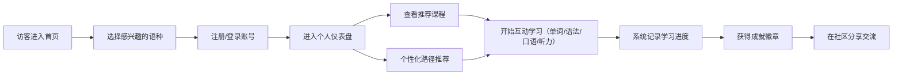
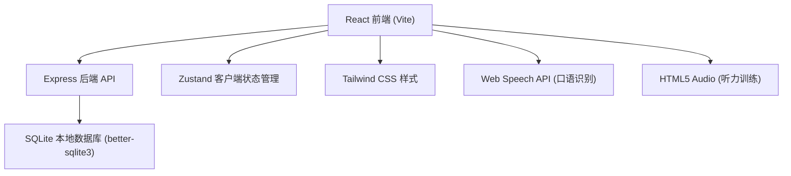
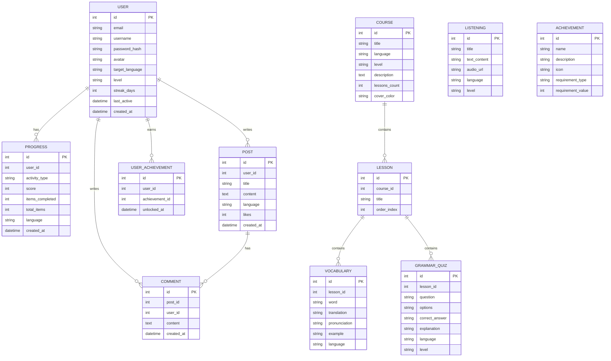

# LinguaVerse 多语种在线学习平台 — 产品需求文档 (PRD)

## 1. 产品概述
- LinguaVerse 是一款支持英语、日语、韩语等主流语种的沉浸式在线教育平台，为全球语言学习者提供分级课程体系、互动式学习模块、进度追踪与社区交流的一体化学习体验。
- 目标用户为学生、职场人士及语言爱好者，平台通过游戏化激励与个性化路径推荐，让学习过程既高效又愉悦。

## 2. 核心功能

### 2.1 用户角色
| 角色 | 注册方式 | 核心权限 |
|------|----------|----------|
| 普通用户 | 邮箱/用户名注册 | 浏览课程、学习互动、查看进度、加入社区、获得成就 |

### 2.2 功能模块
1. **首页/仪表盘**：平台介绍、推荐课程、学习进度概览、今日任务
2. **课程中心**：按语种（英/日/韩）与等级（A1-C2）分级的课程体系
3. **互动学习模块**：单词记忆、语法练习、口语跟读、听力训练
4. **学习进度追踪**：学习时长、掌握单词数、课程完成度、连续学习天数
5. **用户认证**：注册、登录、个人信息管理
6. **个性化推荐**：基于水平与兴趣的智能学习路径推荐
7. **社区交流**：发帖、评论、点赞、学习者互助问答
8. **成就系统**：徽章、等级、排行榜、激励机制

### 2.3 页面详情
| 页面名称 | 模块名称 | 功能描述 |
|----------|----------|----------|
| 首页 | Hero + 推荐 | 展示平台价值、语言选择入口、推荐课程卡片 |
| 课程中心 | 课程列表 | 按语种/级别筛选，显示课程大纲与难度 |
| 学习页面 | 互动模块 | 单词卡片翻转、语法选择题、口语录音回放、听力音频播放 |
| 进度页面 | 数据可视化 | 图表展示学习趋势、掌握度、连续打卡 |
| 社区页面 | 论坛 | 帖子列表、发布、评论、点赞 |
| 成就页面 | 徽章墙 | 已获徽章、未解锁成就、全球排名 |
| 个人中心 | 用户资料 | 头像、昵称、学习目标、密码修改 |
| 登录/注册 | 认证 | 表单验证、状态提示 |

## 3. 核心流程

## 4. 界面设计

### 4.1 设计风格
- **主色调**：深海蓝 `#1e3a8a`（代表全球化与深度）
- **辅助色**：琥珀金 `#f59e0b`（代表激情与成就）+ 翠绿 `#10b981`（代表成长）
- **背景**：深色主题 `#0f172a` 配合渐变光晕，营造沉浸式学习氛围
- **字体**：标题使用 "Space Grotesk" 类几何无衬线，正文使用 "Inter"
- **按钮**：大圆角（rounded-xl）、渐变背景、悬停微抬升动效
- **图标**：lucide-react 线性图标，统一描边宽度

### 4.2 页面设计概览
| 页面 | 布局 | 核心视觉 |
|------|------|----------|
| 首页 | 顶部导航 + Hero + 卡片网格 | 大标题动画入场、多彩语种卡片 |
| 学习页面 | 左右分栏：左侧导航 + 右侧练习区 | 居中大卡片、翻转/拖动等微交互 |
| 进度页面 | 全宽图表 + 统计卡片 | 圆环进度、折线趋势图 |
| 社区页面 | 列表 + 右侧热门 | 贴子卡片、头像、互动按钮 |

### 4.3 响应式
- Desktop-first 设计，断点 md(768px) / lg(1024px)
- 移动端：顶部汉堡菜单、单列流式布局、触控优化

---

# 技术架构文档

## 1. 架构设计

## 2. 技术栈描述
- **前端**：React 18 + TypeScript + Vite + Tailwind CSS 3 + Zustand + React Router DOM + Recharts + lucide-react
- **后端**：Express.js 4 + TypeScript + better-sqlite3 + bcryptjs + jsonwebtoken
- **数据库**：SQLite（本地文件，零配置，便于快速启动演示）
- **认证**：JWT Token 方式
- **交互增强**：Web Speech API（浏览器原生语音识别与合成，无需外部服务）

## 3. 路由定义

### 前端路由
| 路由 | 页面 |
|------|------|
| `/` | 首页/仪表盘 |
| `/courses` | 课程中心 |
| `/courses/:id` | 课程详情 |
| `/learn/vocabulary` | 单词记忆 |
| `/learn/grammar` | 语法练习 |
| `/learn/speaking` | 口语跟读 |
| `/learn/listening` | 听力训练 |
| `/progress` | 学习进度 |
| `/community` | 社区交流 |
| `/achievements` | 成就徽章 |
| `/profile` | 个人中心 |
| `/login` | 登录 |
| `/register` | 注册 |

### 后端 API 路由
| 方法 | 路径 | 用途 |
|------|------|------|
| POST | `/api/auth/register` | 用户注册 |
| POST | `/api/auth/login` | 用户登录 |
| GET | `/api/auth/profile` | 获取当前用户 |
| PUT | `/api/auth/profile` | 更新用户资料 |
| GET | `/api/courses` | 获取课程列表 |
| GET | `/api/courses/:id` | 获取课程详情 |
| GET | `/api/learn/vocabulary` | 获取单词练习数据 |
| GET | `/api/learn/grammar` | 获取语法练习题 |
| GET | `/api/learn/listening` | 获取听力材料 |
| GET | `/api/progress` | 获取学习进度 |
| POST | `/api/progress` | 上报学习进度 |
| GET | `/api/recommendations` | 获取个性化推荐 |
| GET | `/api/community/posts` | 获取社区帖子列表 |
| POST | `/api/community/posts` | 发布帖子 |
| POST | `/api/community/posts/:id/comments` | 评论帖子 |
| POST | `/api/community/posts/:id/like` | 点赞帖子 |
| GET | `/api/achievements` | 获取成就列表与用户进度 |

## 4. 数据模型

### 4.1 ER 图

### 4.2 初始化数据
- 3 种语言（英、日、韩）的示例课程各 1 个
- 每种语言预置 20+ 单词、5+ 语法题
- 预置 8 个成就徽章
- 预置若干社区示例帖子
